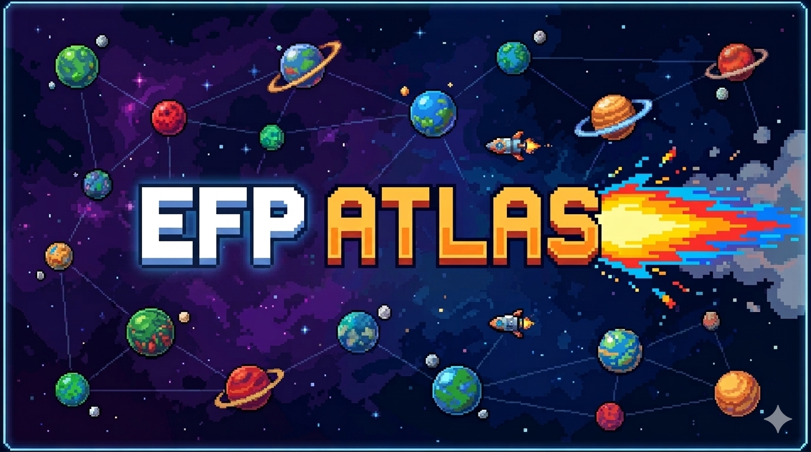

# EFP Atlas



A game-like, interactive map of Ethereum social graph activity built on top of the Ethereum Follow Protocol (EFP).

Users are rendered as planets inside a continuous space world. You can pan, zoom, search, warp, inspect account stats, and share planet cards.

## Why This Exists

Most leaderboard views are list-first and static. This project turns EFP data into a spatial interface:

- Accounts become navigable objects
- Discovery feels exploratory instead of tabular
- Visual traits (size, rings, moons, atmosphere) encode account signals

## Highlights

- Infinite sector exploration with drag + keyboard controls
- Cursor-centered zoom with smooth inertia
- Progressive loading of EFP leaderboard pages
- Planet-level visual encoding of account activity
- Moon count based on real wallet NFT holdings
- Warp search (jump to known wallets quickly)
- Travel mode with rocket steering
- Account details panel + external links
- Shareable planet card modal
- Minimap and HUD for orientation

## Tech Stack

- Next.js 14 (App Router)
- React 18 + TypeScript
- Tailwind CSS
- EFP public API
- Ethereum JSON-RPC (for live ETH balances)

## Getting Started

### 1. Install

```bash
npm install
```

### 2. Run

```bash
npm run dev
```

Open [https://efp-atlas.vercel.app/](https://efp-atlas.vercel.app/).

### 3. Build (production)

```bash
npm run build
npm run start
```

## Data Flow

1. `BubbleUniverse` ensures nearby sectors exist.
2. Each sector maps to one EFP leaderboard page.
3. Accounts are transformed into `Planet` domain objects.
4. ETH balances are fetched in batches and radius is recomputed.
5. NFT holding counts are fetched and synced to moon counts.
6. Scene is rendered from viewport-filtered planets.

## API Endpoints

- `GET /api/efp/leaderboard?page=<n>&limit=<m>`
- `POST /api/eth/balances` with `{ "addresses": string[] }`
- `POST /api/eth/nft-counts` with `{ "addresses": string[] }`

Optional env var:
- `COVALENT_API_KEY` (defaults to public `ckey_docs`)

## Controls

- Pan: drag
- Move: `W A S D` or arrow keys
- Zoom: mouse wheel / trackpad
- Warp: top-center warp search
- Travel mode: `🚀 Travel Space` button (`Esc` to exit)

## Performance Notes

- Request throttling and concurrency limits avoid API spikes
- Sector-level lazy loading keeps memory bounded
- Render list is capped (`MAX_PLANETS_SCREEN`)
- Background stars/nebulae are deterministic and lightweight

## Roadmap Ideas

- Shared URLs for camera position + selected account
- Planet detail route pages (`/planet/[address]`)
- Streaming sector loads with Suspense boundaries
- Observability (Sentry + API timing dashboards)

## License

Private project (no OSS license declared yet).
